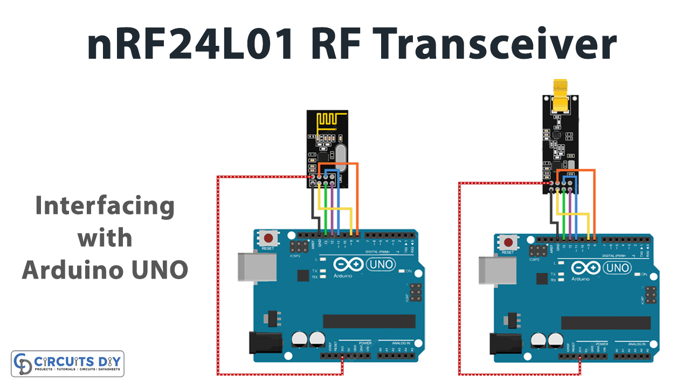
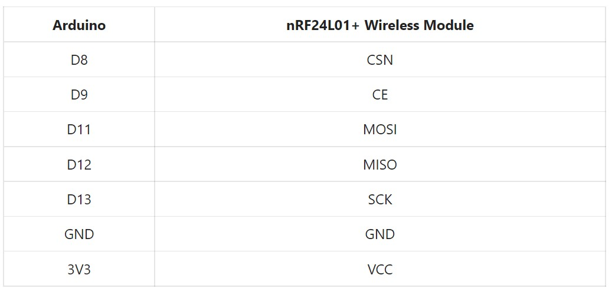
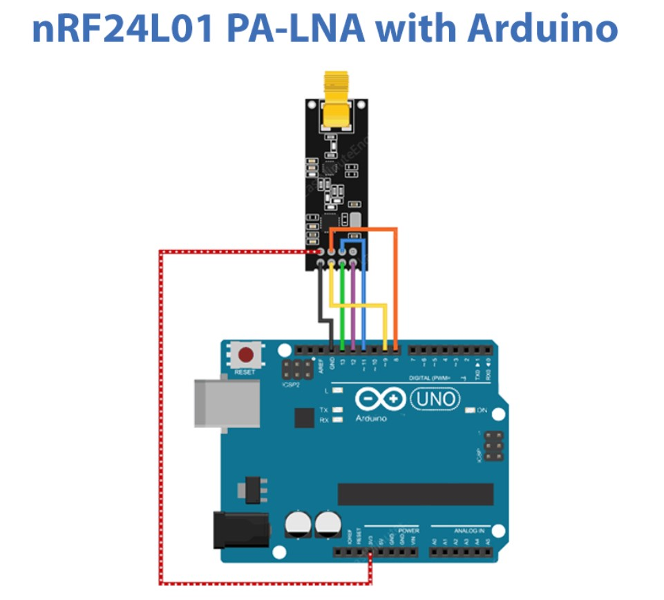
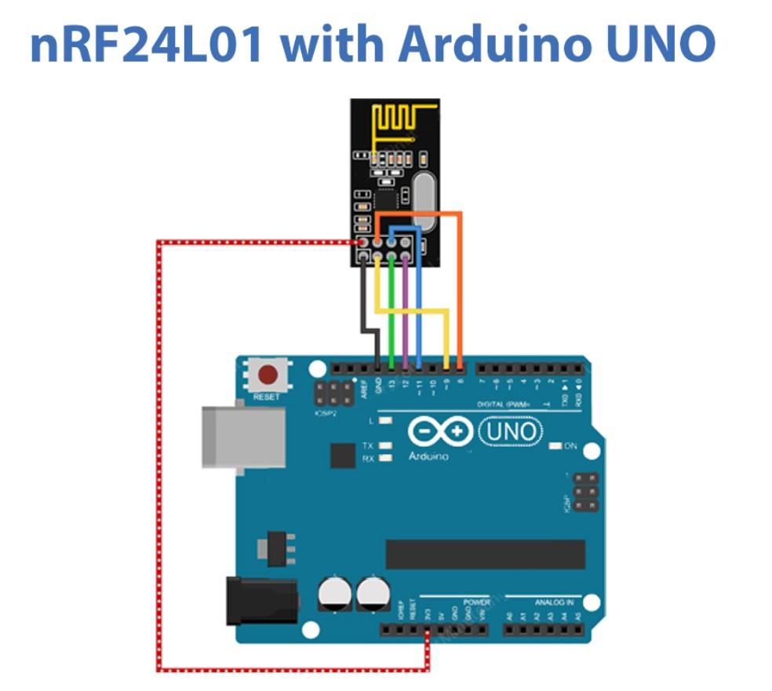

# **Wireless  Transceiver Using  NRF24L01**



## **Introduction**

If you are searching for a project that can interact with two devices wirelessly, then you’re on the ideal spot. Because today we are going to interface ” nRF24L01+ Wireless Module with Arduino UNO”. The simple small device can be used in controlling robots and home automation circuits. Since nRF24L01 is the transceiver module, therefore it can transmit and receive the data within the frequency range of 2.4GHz. Also, the module effortlessly and effectively covers a distance of 200 feet and hence can be a better choice for many wireless projects.

## **An Overview about nRF24L01**

The module works through SPI communication. And, can be interfaced with any microcontroller that has an SPI port. However, it is a little tricky and challenging to handle this module. Also, the module has several cloned versions in the market which makes it more difficult. The module is usually operated on 3.3V. The module transmits and receives the data at a particular frequency known as the channel. Hence, to make the connection between the two transceiver modules, both modules must be on the same channel. The channel could be of any frequency between the range of 2.4GHz to 2.5GHz.

## **Features of nR24L01**

* It has an operating voltage range of 3.3V.

* The module can interact wirelessly from a distance of 50 to 200 feet.

* The channel range is 125.

* It draws the nominal current of 50mA.

* It uses the SPI communication protocol.




## **Circuit Diagram**





## **Connection Table**


## **Arduino Code**

### For Transmitter 

```
//Include Libraries
#include <SPI.h>
#include <nRF24L01.h>
#include <RF24.h>

//create an RF24 object
RF24 radio(9, 8);  // CE, CSN

//address through which two modules communicate.
const byte address[6] = "00001";

void setup()
{
  radio.begin();
  
  //set the address
  radio.openWritingPipe(address);
  
  //Set module as transmitter
  radio.stopListening();
}
void loop()
{
  //Send message to receiver
  const char text[] = "Hello World";
  radio.write(&text, sizeof(text));
  
  delay(1000);
}
```

### **Arduino Code – For Receiver**

```
//Include Libraries
#include <SPI.h>
#include <nRF24L01.h>
#include <RF24.h>

//create an RF24 object
RF24 radio(9, 8);  // CE, CSN

//address through which two modules communicate.
const byte address[6] = "00001";

void setup()
{
  while (!Serial);
    Serial.begin(9600);
  
  radio.begin();
  
  //set the address
  radio.openReadingPipe(0, address);
  
  //Set module as receiver
  radio.startListening();
}

void loop()
{
  //Read the data if available in buffer
  if (radio.available())
  {
    char text[32] = {0};
    radio.read(&text, sizeof(text));
    Serial.println(text);
  }
}
```

## **Working Explanation**

 Connect the nRF24L01 module with Arduino according to the circuit diagram. copy the code of transmitter and receiver and paste it in Arduino IDE. Upload the code. Now, open the serial monitor and observe the message that is coming from the transmitter to the receiver.

 ## Code Explanation

 ### FOR TRANSMITTER

 * To interface nRF24L01 with Arduino, download the SPI and module libraries. You can download the library from:

 * Now include these downloaded libraries. Create an object **RF24** and defines the arduino PINs that are connected with the CE and CSN pins of the sensor. After that, create the array address that defines the pipe address through which the module communicates.
 

 * In the void setup, initialize the radio object **by radio.begin( )**. Then set the transmitter address by using radio. **openWritingPipe( )**. Also, set the module as the transmitter by using the functioning radio. **stoplistening( )**

 * In the void loop, create the character array and give the message Hello world. Finally, send that message using the **radio.write ( )**.


 ## FOR RECEIVER:

The code of the receiver side is quite similar to the transmitter side. However, there are some changes that have to be made.

* In the void setup, by using radio. **setReadingpipe( )**. Set the transmitter address to enable the communication.

* In the void loop, the program checks whether the data has arrived by using the functioning **radio.available( )**. If it gets the data then it creates the 32 character array that is filled with all the 0s initially. Later, it will fill with the receiver data. And, then to read the data use the functions radio. read ( ). Print the data on the Serial monitor by Serial. begin( ).


## **Application and Uses**

* For wireless communication.

* In mesh networks.

* RF remote controller. 


